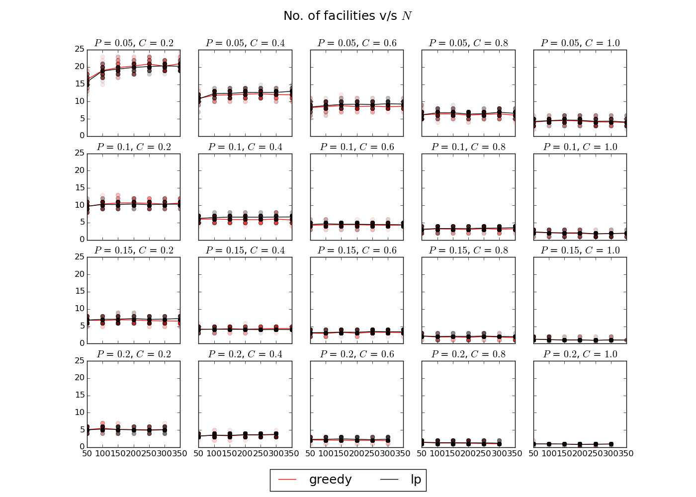
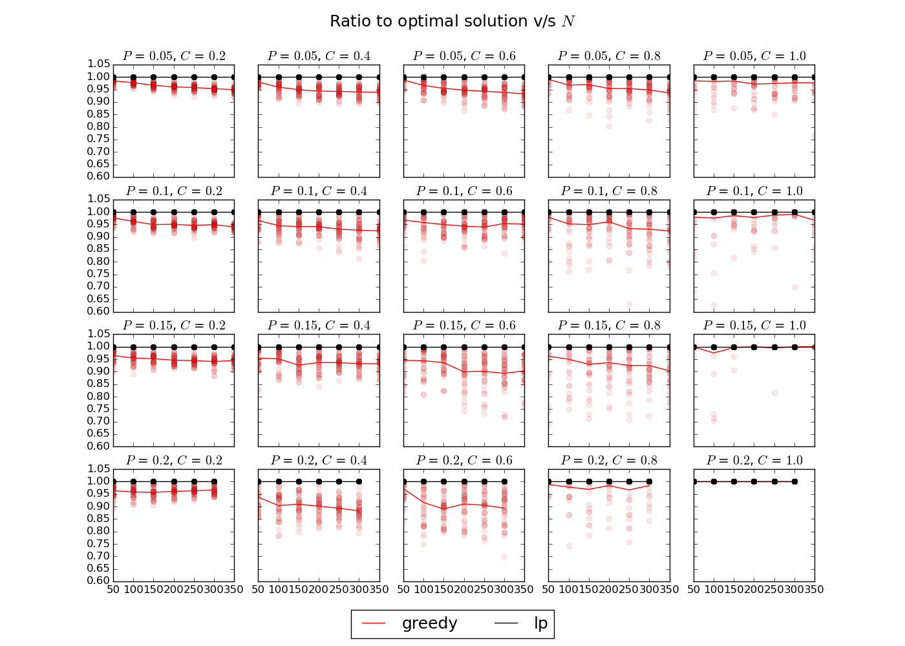
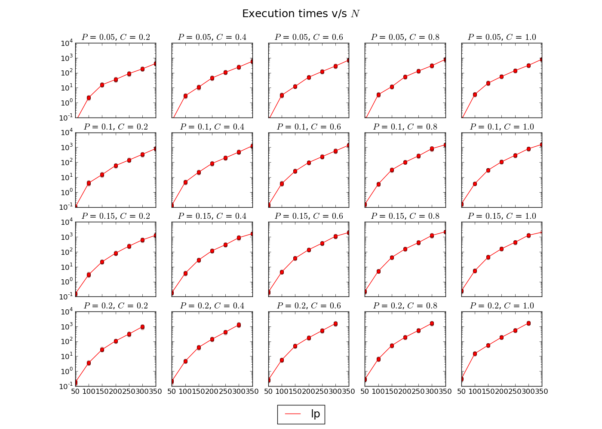

# Problems for experimentation

All of the generated test problems will have $N$ clients and $N$ possible facility locations randomly positioned on equiprobable points on a square $[0,L] \times [0,L]$. Since there the problems have this random component, many problems will be generated and the mean of the values, execution times, and number of facilities, will be taken.

# Parameters for experimental design

After some experimentation, we discovered that the problems where the optimal number of **selected** facilities is very high are not of interest since the greedy solution is, relatively speaking, only a little worse than the optimal one and the LP formulation of the problem appears to be more integer-friendly so it can be solved with `lp_solve` on an acceptable time.

<!-- NOTE: got to be sure about the "more integer-friendly" hypothesis ^-->

Being $N$ the number of clients and also the number of possible facility locations (so that $N$ becomes the only parameter that describes the complexity of the problem):

The idea is to choose parameters on a way that the expected number of facilities on the optimal solution remains somewhat constant when changing $N$. The chosen values for this parameters for each experiment will determinate the $\alpha$ and $\gamma$. The $beta$ and $L$ (the side of the square where the possible facility locations and clients appear) can be set as constants.

### Portion of the total gain

If we assume that the distribution of the total gain is uniform, each differential of area adds $\alpha N/L^2$ gain, however, due to transport costs, if that differential is at a distance $r$ of the nearest facility, it really adds:

\[
\left| \alpha - r \beta \right|_{+} \frac{N}{L^2}
\]

Integrating over the area of the circle of radius $r_{crit} = \alpha/\beta$ can be seen like the obtaining the volume of a cone of height $\alpha N/L^2$. This results on the expected gain for a free facility:

\[
\frac{\pi}{3} \frac{N}{L^2} \frac{\alpha^3}{\beta^2}
\]

As the total gain is $\alpha N$, the portion of the total gain that a facility is expected to catch is:

\[
P = \frac{\pi}{3L^2} \frac{\alpha^2}{\beta^2}
\]

### Expected relative cost

The expected relative cost is the relation between the cost of a facility and its expected gain:

\[
C = \frac{\gamma}{\alpha N P}
\]

## Calculation of the problem parameters

The initial problem parameters are calculated from $N,P,C$ as:

| Parameter | Formula |
| :-------- | :---: |
| $L$         | $10000$ |
| $N$         | $N$     |
| $\beta$     | $1$ |
| $\alpha$    | $\sqrt{\frac{3L^2 \beta^2 P}{\pi}}$ |
| $\gamma$    | $C \alpha N P$ |

# Experimental design:

The experimental design covers the following tests, the first two are to understand the problem, the behavior of `lp_solve` when trying to solve it to understand better its *integer-friendliness* and the behavior of the `greedy` algorithm, knowing that `geoloc` aim to be between both algorithms.

1. **parameters**: find how the $N,P,C$ parameters affect the number of facilities on the optimal solution $NF$. For values of $N$ large enough it shall stabilize when keeping $P,C$ constant. The mean number of facilities, with their standard deviation, of the optimal solution of several generated problems will be tabulated for different values of $N,P,C$. If possible, try to find a clear relation between the number of facilities on the optimal solution $NF$ and $P,C$ when $1 << N$.

2. **identify**: find the values of $P,C$ so that the difference between the result obtained with `lp_solve` and those with greedy are most different, also check for those problems when `lp_solve` takes longer (meaning that the problem is less *integer-friendly*). This problems are interesting because they should be the ones where the algorithm is most useful. **The number of used facilities**, **% of the optimal value obtained** and **execution time** of both `lp_solve` and `greedy` will be plotted against $N$ for different values of $P$ and $C$.

3. **poolsize**: for the problems generated with *interesting* values of $P,C$, the results obtained with `geoloc` against the $PZ$ parameter will be plotted, as $PZ$ increases the quality of the obtained solutions should also increase, and move between the `greddy` and the optimal `lp_solve` solution. Since `Full-`$VR$ will be used (that means $VR=N \cdot PZ$) only small ($\approx 300$) values of $PZ$ will be used.

4. **vreffect:** the purposes of this experiments are to find an optimal relation between $PZ$ and $VR$ for different values of $N$, and if possible, relate this variables to memory capacity $CP = N \cdot PZ \cdot VR$. For this purpose the quality of the `geoloc` solutions will be plotted against the $VR$ for different values of $PZ$ for different values of $N$. The idea is to find one or more *strategies* to choose $PZ$ and $VR$ (considerating $CP$) to solve a general problem.

5. **extension**: similar experiments than in the **identify** step will be run but now testing different *strategies* obtained in the previous step to see how they behave against different problems

6. **setcovering**: test the *strategies* but now with the problem without gradual decay of the gain due to transport cost, this problem is less *integer-friendly* as its more like a *set-covering*, so the solution with linear programming takes longer.

# Running experiments

Each experiment has 3 scripts, `generate.sh` that generates the problems, `solve.sh` that solves the problems with the algorithms and `collect.sh` that merges the results. the `solve.sh` were set to be processed with the command `qsub solve.sh` on the HPC Clúster.

# Results

## Identify

Each experiment was run for 40 randomly generated test cases, the *means* are displayed as a curve.

From this graph we can see that specific choices of parameters $P$ and $C$ keep the number of facilities of the optimal solution constant as $N$ gets bigger, so keeping this parameters constant we can say that $N$ is the parameter of complexity.

We can see that the major differences between the solution obtained with the *greedy* algorithm and the optimal solution happen for larger values of $P$, $P \approx 0.2$ and values of $C$ around $0.5$, this happens when the number of facilities is between $3$ and $5$.

Since the algorithm is well suited for problems where the number of facilities on the optimal solution is big but it would we worth to use it on problems where *greedy* doesn't perform very well, we will focus on problems with $C=0.5$ and $P=0.15$, where we can expect $4$ or $5$ facilities on the optimal solution.

From this graph we can see that the execution times for $N=300$ can be up to 10 times larger than for small values of $P$ (with there are less facilities on the optimal solution than when there are many), this difference however is not very significant but is another reason to use the algorithm for this particular set of problems.

## Extension

As the results of **vreffect** weren't very conclusive, the following strategies to assign a value to $PZ$ and $VR$ will be tested:

| Parameter | Values |
| :-------- | :---: |
| $PZ$      | $\{1,\sqrt{N},N\}$ |
| $VR$      | $\{1,N,PZ,\sqrt{N \times PZ},PZ \times \sqrt{N}, \sqrt{PZ} \times N \}$ |

Which are equivalent to the following strategies:

| Strategy | $PZ$ | $VR$  |
| :--------   | :---: | :---: |
| greedy      | 1 | 1 |
| gl-n1o2-1    | $\sqrt{N}$  | 1 |
| gl-n1o2-n    | $\sqrt{N}$  | $N$ |
| gl-n1o2-n3o2 | $\sqrt{N}$  | $N^{3/2}$ |
| gl-n-1       | $N$  | 1 |
| gl-n-n1o2    | $N$  | $\sqrt{N}$ |
| gl-n-n3o4   | $N$  | $N^{3/4}$ |
| gl-n-n      | $N$  | $N$ |
